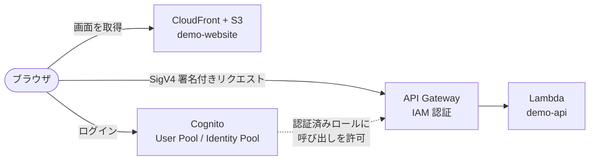

# aws-nx-pl

[Nx](https://nx.dev) と [@aws/nx-plugin](https://awslabs.github.io/nx-plugin-for-aws) で構築した、AWS 上で動くフルスタック Web アプリケーションのモノレポです。

- **demo-website:** React 製の Web サイト。Cognito でログインし、CloudFront + S3 から配信される
- **demo-api:** tRPC 製の API。API Gateway + Lambda で動き、ログイン済みユーザーだけが呼び出せる
- **infra:** 上記をまとめて AWS にデプロイする CDK アプリ

## 構成



1. ブラウザが CloudFront から画面と `runtime-config.json`（API の URL や Cognito の ID）を取得する
2. 未ログインなら Cognito のログイン画面に移動する
3. ログイン後、Identity Pool から一時的な AWS 認証情報を受け取る
4. その認証情報で署名したリクエストを API Gateway に送る。API Gateway は IAM で検証してから Lambda を呼び出す

詳しくは [docs/architecture.md](./docs/architecture.md) を参照してください。

## ディレクトリ構成

```
packages/
├── demo-api/           # tRPC API（Lambda で動く）
├── demo-website/       # React Web サイト
├── infra/              # CDK アプリ（デプロイ定義）
└── common/
    ├── constructs/     # CDK の部品（ジェネレーターが生成）
    └── shadcn/         # 共通 UI コンポーネント（shadcn/ui）
docs/                   # 詳細ドキュメント
```

| 変更したいもの | 主に触るファイル |
|---|---|
| API の処理 | `packages/demo-api/src/procedures/`、`src/router.ts`、`src/schema/` |
| 画面 | `packages/demo-website/src/routes/` |
| サイドバーのメニュー | `packages/demo-website/src/components/app-sidebar.tsx` |
| AWS リソース | `packages/infra/src/stacks/application-stack.ts` |

## 技術スタック

| 分類 | 技術 |
|---|---|
| モノレポ | Nx 23、pnpm（カタログでバージョンを一元管理） |
| 言語 | TypeScript |
| API | tRPC、Zod、AWS Lambda Powertools（ログ、トレース、メトリクス） |
| Web サイト | React 19、Vite、TanStack Router、TanStack Query、Tailwind CSS v4、shadcn/ui |
| 認証 | Amazon Cognito（User Pool、Identity Pool）、react-oidc-context |
| インフラ | AWS CDK（API Gateway、Lambda、CloudFront、S3、Cognito、WAF、AppConfig） |
| 品質 | Biome（フォーマット、Lint）、Vitest、Checkov、git-secrets |

## クイックスタート

### 前提

- Node.js 24 系
- pnpm 11 系
- デプロイする場合は AWS CLI と AWS の認証情報、ビルドで Checkov を実行する場合は [uv](https://docs.astral.sh/uv/)

### 1. 依存関係をインストールする

```sh
pnpm install
```

### 2. ローカルで起動する（AWS 不要）

```sh
pnpm nx run @aws-nx-pl/demo-website:dev
```

- Web サイト: http://localhost:4200
- API: http://localhost:2022

ローカルでは Cognito のログインと署名が省略され、画面はローカルの API を呼びます。

### 3. AWS にデプロイする

```sh
# アカウントとリージョンごとに初回のみ
pnpm nx run @aws-nx-pl/infra:synth
pnpm nx run @aws-nx-pl/infra:bootstrap

# デプロイ（API と Web サイトのビルドも自動で行う）
pnpm nx run @aws-nx-pl/infra:deploy-sandbox
```

デプロイ先は、実行時の AWS 認証情報のアカウントとリージョンです（`CDK_DEFAULT_ACCOUNT` / `CDK_DEFAULT_REGION`）。

sandbox 環境は開発用なので、料金を抑える設定になっています。

| 設定 | sandbox | 本番向けの既定値 |
|---|---|---|
| WAF | 無効 | 有効（Cognito、API、CloudFront） |
| Cognito の機能プラン | Essentials（10,000 MAU まで無料） | Plus（脅威保護あり、無料枠なし） |
| 使っていないときの固定費の目安 | 月 $2〜3 程度 | 月 $25 前後 |

本番環境を追加するときは、既定値のまま使ってください。
詳しくは [docs/infrastructure.md](./docs/infrastructure.md#環境ごとの設定料金とセキュリティ) を参照してください。

### 4. ユーザーを作成してログインする

セルフサインアップは無効なので、管理者がユーザーを作成します。
User Pool ID はデプロイ完了時の Outputs（`...UserPoolId...`）で確認できます。

```sh
aws cognito-idp admin-create-user \
  --user-pool-id <User Pool ID> \
  --username <ユーザー名> \
  --user-attributes \
    Name=email,Value=<メールアドレス> Name=email_verified,Value=true \
    Name=given_name,Value=<名> Name=family_name,Value=<姓>
```

Outputs の `...DistributionDomainName...` を `https://` 付きで開きます。
一時パスワードでログインし、パスワード変更と MFA（認証アプリ推奨）を設定します。

### 5. 環境を削除する

```sh
pnpm nx run @aws-nx-pl/infra:destroy-sandbox
```

Cognito User Pool や一部の KMS キーなどは、誤って削除しないように保持（Retain）される設定になっています。
完全に削除する手順は [docs/infrastructure.md](./docs/infrastructure.md#環境の削除) を参照してください。

## よく使うコマンド

| コマンド | 内容 |
|---|---|
| `pnpm nx run @aws-nx-pl/demo-website:dev` | ローカル開発サーバー（Web + API）を起動する |
| `pnpm nx run @aws-nx-pl/demo-api:serve` | API のローカルサーバーだけを起動する |
| `pnpm nx run @aws-nx-pl/demo-website:load-runtime-config` | デプロイ済みの `runtime-config.json` を取得する（ローカルで本物の Cognito ログインを使う場合） |
| `pnpm nx run @aws-nx-pl/infra:synth` | CloudFormation テンプレートを生成する |
| `pnpm nx run @aws-nx-pl/infra:deploy-sandbox` | sandbox 環境にデプロイする |
| `pnpm nx run @aws-nx-pl/infra:destroy-sandbox` | sandbox 環境を削除する |
| `pnpm nx test <プロジェクト>` | テストを実行する |
| `pnpm nx build <プロジェクト>` | 1つのプロジェクトをビルドする |
| `pnpm nx run-many -t lint typecheck test` | 全プロジェクトの Lint、型チェック、テストを実行する |
| `pnpm lint` | 全プロジェクトの Lint を自動修正付きで実行する |
| `pnpm build:all` | 全プロジェクトをビルドする |
| `pnpm nx sync` | TypeScript のプロジェクト参照を更新する |
| `pnpm nx graph` | プロジェクトの依存関係を表示する |

プロジェクト名は `@aws-nx-pl/demo-api`、`@aws-nx-pl/demo-website`、`@aws-nx-pl/infra`、`@aws-nx-pl/common-constructs`、`@aws-nx-pl/common-shadcn` です。

## ドキュメント

| ドキュメント | 内容 |
|---|---|
| [docs/architecture.md](./docs/architecture.md) | システム全体の構成、AWS リソース、リクエストの流れ |
| [docs/project-structure.md](./docs/project-structure.md) | ディレクトリとファイルの役割 |
| [docs/authentication.md](./docs/authentication.md) | Cognito 認証と API の認可、ユーザー管理 |
| [docs/api-development.md](./docs/api-development.md) | API に procedure を追加する手順、テスト |
| [docs/website-development.md](./docs/website-development.md) | ページの追加、API の呼び出し、UI |
| [docs/infrastructure.md](./docs/infrastructure.md) | CDK の構成、デプロイ、削除、リソースの追加 |
| [docs/development-workflow.md](./docs/development-workflow.md) | ローカル開発、コマンド、トラブルシューティング |

## 使えるジェネレーター

`@aws/nx-plugin` のジェネレーターで、プロジェクトや機能のひな形を生成できます。

```sh
pnpm nx g @aws/nx-plugin:<ジェネレーター名>
```

[Nx Console](https://nx.dev/getting-started/editor-setup)（VS Code / IntelliJ の拡張機能）を使うと、GUI からも実行できます。

| ジェネレーター | 内容 |
|---|---|
| `init` | 既存の Nx ワークスペースで @aws/nx-plugin を使えるようにする |
| `connection` | 2つのプロジェクトを接続する（例: Web サイト → API） |
| `license` | LICENSE ファイルとソースコードのライセンスヘッダーを追加する |
| `ts#project` | TypeScript プロジェクトを生成する |
| `ts#api` | TypeScript の API（tRPC / Smithy）を生成する |
| `ts#website` | Web サイト（React）を生成する |
| `ts#website#auth` | 既存の Web サイトに Cognito 認証を追加する |
| `ts#infra` | CDK アプリを生成する |
| `ts#lambda-function` | TypeScript の Lambda 関数を追加する |
| `ts#mcp-server` | TypeScript の MCP サーバーを生成する |
| `ts#dcr-proxy` | Cognito 認証の MCP サーバー向けに、OAuth 動的クライアント登録（DCR）プロキシを生成する |
| `ts#agent` | TypeScript プロジェクトに AI エージェントを追加する |
| `ts#dynamodb` | TypeScript の DynamoDB プロジェクトを生成する |
| `ts#rdb` | TypeScript のリレーショナルデータベースプロジェクトを生成する |
| `ts#docs` | ドキュメントサイトを生成する |
| `ts#nx-generator` | 既存の TypeScript プロジェクトに Nx ジェネレーターを追加する |
| `ts#nx-migration` | Nx プラグインに、アップグレード時に適用されるマイグレーションを追加する |
| `ts#nx-plugin` | 独自の Nx プラグインを生成する |
| `py#project` | Python プロジェクトを生成する |
| `py#api` | Python の API を生成する |
| `py#lambda-function` | Python プロジェクトに Lambda 関数を追加する |
| `py#mcp-server` | Python の MCP サーバーを生成する |
| `py#agent` | Python プロジェクトに AI エージェントを追加する |
| `py#dynamodb` | Python の DynamoDB プロジェクトを生成する |
| `py#rdb` | Python のリレーショナルデータベースプロジェクトを生成する |
| `smithy#project` | Smithy のモデルプロジェクトを生成する |
| `terraform#project` | Terraform プロジェクトを生成する |
| `agentcore-gateway` | AgentCore Gateway プロジェクトを生成する |
| `agentcore-harness` | AgentCore Harness プロジェクトを生成する（実験的） |

各ジェネレーターの詳細は [公式ドキュメント](https://awslabs.github.io/nx-plugin-for-aws) を参照してください。

## 参考リンク

- [@aws/nx-plugin クイックスタート](https://awslabs.github.io/nx-plugin-for-aws/en/get_started/quick-start/)
- [@aws/nx-plugin チュートリアル（AI ダンジョンゲーム）](https://awslabs.github.io/nx-plugin-for-aws/en/get_started/tutorials/dungeon-game/overview/)
- [Nx のタスク実行](https://nx.dev/features/run-tasks)
- [tRPC](https://trpc.io/)
- [AWS CDK デベロッパーガイド](https://docs.aws.amazon.com/cdk/v2/guide/home.html)
