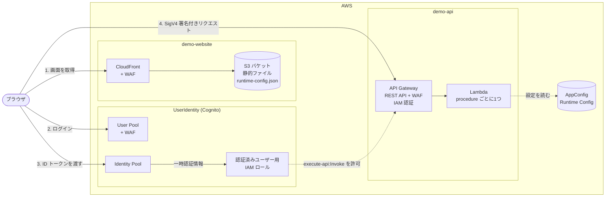
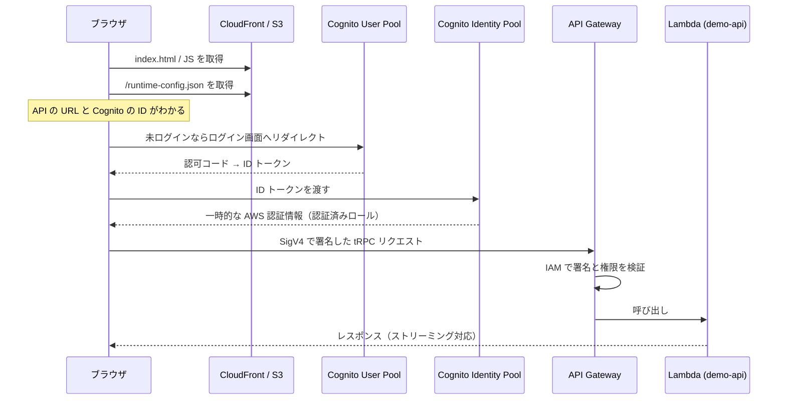
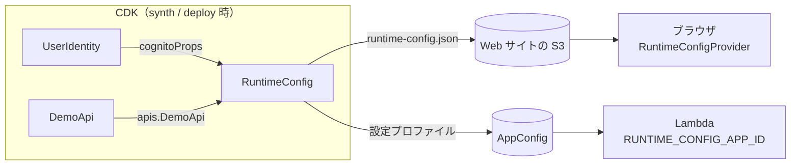

# アーキテクチャ

## 全体像

このリポジトリは、次の3つの要素で構成された Web アプリケーションです。

- **demo-website:** React 製の SPA。CloudFront + S3 から配信される
- **demo-api:** tRPC 製の API。API Gateway（REST API）+ Lambda で動く
- **Cognito（UserIdentity）:** ユーザーのログインと、API を呼ぶための AWS 認証情報の発行を担当する

これらはすべて `packages/infra`（CDK アプリ）によって1回のデプロイでまとめて構築されます。



## リクエストの流れ

ユーザーが画面を開いてから API のレスポンスを受け取るまでの流れです。



各ステップの詳細は [authentication.md](./authentication.md) を参照してください。

## デプロイされる AWS リソース

`pnpm nx run @aws-nx-pl/infra:synth` の結果から、主なリソースを抜き出したものです。

### Application スタック（デプロイ先リージョン）

| 分類 | リソース | 説明 |
|---|---|---|
| 認証 | Cognito User Pool | ユーザーのディレクトリ。MFA 必須、セルフサインアップ無効。既定は Plus プラン（脅威保護あり）、sandbox は Essentials プラン。スタックを削除しても**残る**（Retain） |
| 認証 | User Pool Client / Domain / Managed Login | ログイン画面（Cognito のマネージドログイン）の設定 |
| 認証 | Identity Pool + 認証済みロール | ログイン済みユーザーに一時的な AWS 認証情報を発行する |
| 認証 | WAF（REGIONAL） | User Pool を保護する。**WAF 有効時のみ** |
| API | API Gateway REST API | IAM 認証。WAF（REGIONAL）付き（**WAF 有効時のみ**）。アクセスログは KMS で暗号化 |
| API | Lambda（`echo` など） | tRPC の procedure ごとに1つ作られる。Node.js 24、X-Ray トレース有効 |
| Web | S3 バケット | ビルドした Web サイトと `runtime-config.json` を置く |
| Web | CloudFront ディストリビューション | S3 を OAC 経由で配信する |
| 設定 | AppConfig | Lambda が実行時に読む設定（Runtime Config のサーバー側） |

### WAF スタック（us-east-1、WAF 有効時のみ）

sandbox 環境は料金を抑えるために WAF を無効にしているので、このスタックは作られません。
WAF を有効にした環境（`enableWaf` の既定値は `true`）では、次のように作られます。

CloudFront 用の WAF は us-east-1 に作る必要があるため、別スタック
（CDK 上のパスは `aws-nx-pl-infra-sandbox/Application/DemoWebsite/waf`）として自動的に作られます。
Application スタックからは、リージョンをまたいだ参照（`crossRegionReferences`）で利用します。

## Runtime Config（設定の受け渡し）

API の URL や Cognito の ID は、デプロイするまで決まりません。
そのため、コードには直接書かず、`RuntimeConfig` という仕組みで実行時に渡します。



- **ブラウザ側:** `https://<CloudFront のドメイン>/runtime-config.json` を読み込む。キャッシュされないように、静的ファイルとは別にデプロイされる
- **Lambda 側:** 環境変数 `RUNTIME_CONFIG_APP_ID` で AppConfig のアプリケーションを知り、そこから読み込む

`runtime-config.json` の中身の例です。

```json
{
  "cognitoProps": {
    "region": "ap-northeast-1",
    "identityPoolId": "ap-northeast-1:xxxxxxxx-...",
    "userPoolId": "ap-northeast-1_XXXXXXXXX",
    "userPoolWebClientId": "xxxxxxxxxxxxxxxxxxxxxxxxxx"
  },
  "apis": {
    "DemoApi": "https://xxxxxxxxxx.execute-api.ap-northeast-1.amazonaws.com/prod/"
  }
}
```

## セキュリティ上のポイント

- **API の認可:** API Gateway は IAM 認証です。署名のないリクエストや、権限のないロールからのリクエストは拒否されます。例外として、ブラウザのプリフライト（`OPTIONS`）だけは誰でも通るようにしています
- **権限付与:** `demoApi.grantInvokeAccess(userIdentity.identityPool.authenticatedRole)` で、Cognito にログインしたユーザーのロールだけに `execute-api:Invoke` を許可しています
- **CORS:** `demoApi.restrictCorsTo(demoWebsite)` で、CloudFront のドメインからの呼び出しだけを許可しています。API Gateway のプリフライト応答も、この許可リストに従います。そのため、`localhost` で動かしている画面から**デプロイ済みの** API を直接呼ぶことはできません（ローカル開発では、画面はローカルの API サーバーを呼びます。[development-workflow.md](./development-workflow.md) を参照）
- **WAF:** User Pool、API Gateway、CloudFront の3か所に AWS マネージドルール（Common Rule Set、Known Bad Inputs）を適用しています。ただし、**sandbox 環境では料金を抑えるために無効**にしています。本番環境では既定値（有効）のまま使ってください（[infrastructure.md](./infrastructure.md#環境ごとの設定料金とセキュリティ) 参照）
- **Checkov:** `infra:build` 実行時に、合成された CloudFormation テンプレートを Checkov でスキャンします
