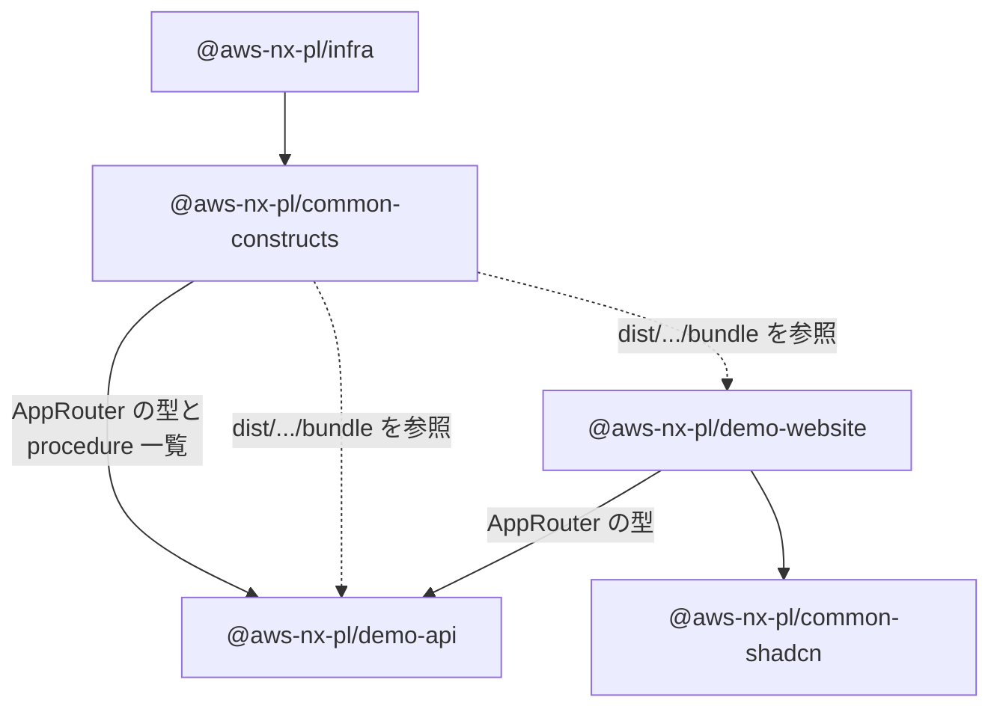

# プロジェクト構成

## ルート

```
aws-nx-pl/
├── packages/                  # すべてのプロジェクト（pnpm ワークスペース）
│   ├── demo-api/              # tRPC API
│   ├── demo-website/          # React Web サイト
│   ├── infra/                 # CDK アプリ
│   └── common/
│       ├── constructs/        # CDK の部品（ジェネレーターが生成）
│       └── shadcn/            # UI コンポーネントライブラリ
├── docs/                      # このドキュメント
├── dist/                      # ビルド成果物（Git 管理外）
├── aws-nx-plugin.config.mts   # @aws/nx-plugin の設定（IaC は CDK、パッケージ管理は pnpm カタログ）
├── nx.json                    # Nx の設定
├── pnpm-workspace.yaml        # ワークスペースの定義と、依存バージョンの一元管理（catalog）
├── biome.json                 # フォーマッター / リンター（Biome）の設定
├── tsconfig.base.json         # 全プロジェクト共通の TypeScript 設定
└── vitest.config.mts          # テストの設定
```

### Nx のプロジェクト名

Nx のプロジェクト名には、npm スコープ `@aws-nx-pl/` が付きます。

| ディレクトリ | Nx プロジェクト名 |
|---|---|
| `packages/demo-api` | `@aws-nx-pl/demo-api` |
| `packages/demo-website` | `@aws-nx-pl/demo-website` |
| `packages/infra` | `@aws-nx-pl/infra` |
| `packages/common/constructs` | `@aws-nx-pl/common-constructs` |
| `packages/common/shadcn` | `@aws-nx-pl/common-shadcn` |

一覧は `pnpm nx show projects` で確認できます。

### 依存バージョンの管理（pnpm カタログ）

`pnpm-workspace.yaml` の `catalogMode: strict` により、依存パッケージのバージョンは
`pnpm-workspace.yaml` の `catalog:` にまとめて書きます。
各 `package.json` には `"zod": "catalog:"` のように書くだけです。

### 依存関係



## packages/demo-api（tRPC API）

```
demo-api/
├── src/
│   ├── index.ts            # パッケージの公開口（AppRouter 型、appRouter、クライアント、スキーマ）
│   ├── init.ts             # tRPC の初期化と publicProcedure の定義（ミドルウェアを適用）
│   ├── router.ts           # procedure を登録するルーター ★よく触る
│   ├── procedures/         # 各 procedure の実装 ★よく触る
│   │   └── echo.ts
│   ├── schema/             # 入出力の Zod スキーマ ★よく触る
│   │   ├── echo.ts
│   │   ├── index.ts
│   │   └── z-async-iterable.ts   # ストリーミング（サブスクリプション）用のヘルパー
│   ├── middleware/         # 全 procedure に適用される共通処理
│   │   ├── logger.ts       # Powertools Logger（構造化ログ）
│   │   ├── tracer.ts       # Powertools Tracer（X-Ray）
│   │   ├── metrics.ts      # Powertools Metrics（CloudWatch メトリクス）
│   │   └── error.ts        # 想定外のエラーを INTERNAL_SERVER_ERROR に変換
│   ├── handler.ts          # Lambda のエントリーポイント（CORS ヘッダーの付与もここ）
│   ├── local-server.ts     # ローカル開発用 HTTP サーバー（ポート 2022）
│   └── client/index.ts     # Node.js から API を呼ぶためのクライアント（SigV4 署名付き）
├── rolldown.config.ts      # Lambda 用バンドルの設定 → dist/packages/demo-api/bundle
└── project.json            # Nx のタスク定義
```

## packages/demo-website（React Web サイト）

```
demo-website/
├── src/
│   ├── main.tsx                     # エントリーポイント。Provider を重ねてアプリを起動する
│   ├── config.ts                    # アプリ名とロゴ
│   ├── styles.css                   # Tailwind CSS
│   ├── routes/                      # ページ（ファイルベースルーティング） ★よく触る
│   │   ├── __root.tsx               # 全ページ共通のレイアウト
│   │   └── index.tsx                # "/" のページ
│   ├── routeTree.gen.ts             # routes/ から自動生成される（手で編集しない）
│   ├── components/
│   │   ├── AppLayout/               # ヘッダー、サイドバー、ユーザーメニュー
│   │   ├── app-sidebar.tsx          # サイドバーのナビゲーション
│   │   ├── CognitoAuth/             # Cognito ログイン（react-oidc-context）
│   │   ├── RuntimeConfig/           # runtime-config.json の読み込み
│   │   ├── QueryClientProvider.tsx  # TanStack Query の設定
│   │   ├── DemoApiClientProvider.tsx # demo-api 用 tRPC クライアント
│   │   ├── alert.tsx / spinner.tsx  # 共通の小さな部品
│   └── hooks/
│       ├── useDemoApi.tsx           # 画面から demo-api を呼ぶためのフック ★よく使う
│       ├── useRuntimeConfig.tsx     # Runtime Config を取得するフック
│       └── useSigV4.tsx             # リクエストへの SigV4 署名
├── public/                          # そのまま配信される静的ファイル
├── index.html
└── vite.config.mts                  # Vite の設定（開発サーバーは 4200 番ポート）
```

## packages/infra（CDK アプリ）

```
infra/
├── src/
│   ├── main.ts                      # CDK アプリの起点。Stage（環境）を定義する
│   ├── stages/application-stage.ts  # 1つの環境に含まれるスタックの一覧
│   └── stacks/application-stack.ts  # 実際に作るリソースの組み立て ★よく触る
├── cdk.json                         # CDK の設定（出力先: dist/packages/infra/cdk.out）
└── checkov.yml                      # Checkov（セキュリティスキャン）の設定
```

## packages/common/constructs（CDK の部品）

ジェネレーターが生成・更新するコードです。
基本的には触らず、`infra` から使うだけにしてください。
ジェネレーターを再実行したときに上書きされる可能性があります。

```
constructs/src/
├── app/                           # このアプリ固有の Construct
│   ├── apis/demo-api.ts           # DemoApi（API Gateway + Lambda）
│   └── static-websites/demo-website.ts  # DemoWebsite（CloudFront + S3）
└── core/                          # 汎用の Construct
    ├── user-identity.ts           # UserIdentity（Cognito 一式）
    ├── static-website.ts          # StaticWebsite の基底クラス
    ├── runtime-config.ts          # RuntimeConfig（S3 と AppConfig への設定配布）
    ├── api/rest-api.ts            # RestApi の基底クラス（ログ、WAF、CORS）
    ├── api/trpc-utils.ts          # tRPC のルーターを API Gateway の操作に変換
    ├── app.ts                     # CDK App（メタデータ付与）
    ├── checkov.ts                 # Checkov ルールの抑制ヘルパー
    └── cloudfront.ts              # CloudFront のドメイン名取得ヘルパー
```
